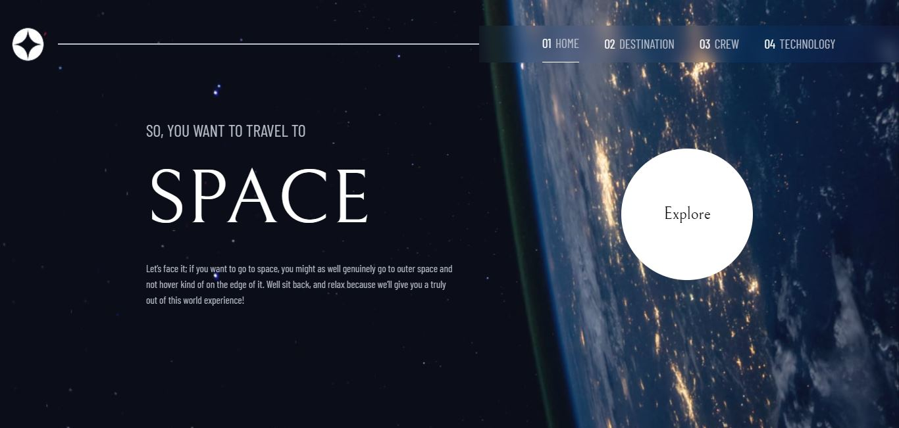

# Frontend Mentor - Space tourism website solution

This is a solution to the [Space tourism website challenge on Frontend Mentor](https://www.frontendmentor.io/challenges/space-tourism-multipage-website-gRWj1URZ3). Frontend Mentor challenges help you improve your coding skills by building realistic projects. 

## Table of contents

- [Overview](#overview)
  - [The challenge](#the-challenge)
  - [Screenshot](#screenshot)
  - [Links](#links)
- [My process](#my-process)
  - [Built with](#built-with)
  - [What I learned](#what-i-learned)
  - [Continued development](#continued-development)
- [Author](#author)

## Overview

### The challenge

Users should be able to:

- View the optimal layout for each of the website's pages depending on their device's screen size
- See hover states for all interactive elements on the page
- View each page and be able to toggle between the tabs to see new information

### Screenshot

### Links

- Live Site URL: [https://space-tourism-fv.netlify.app/](https://space-tourism-fv.netlify.app/)

## My process

### Built with

- Semantic HTML5 markup
- CSS custom properties
- Flexbox
- Mobile-first workflow
- [React](https://reactjs.org/) - JS library
- [React Router Dom](https://reactrouter.com/en/v6.3.0/getting-started/overview) - JS library
- [Framer Motion](https://www.framer.com/motion/) - React Library for animation

### What I learned

During this project I decided to make the animations with framer motion, a very practical and effective React library. I learned how to use this powerful tool with many features, for example its "animate", "initial", "transition" props and more. I highly recommend this library, it is super powerful and simple.

### Continued development

Despite everything I learned about framer motion, this library has so many functions that I haven't used even half of it, that's why I would like to go deeper into the use of this technology. Finally I consider that my code has some improvements, so at some point I will continue to optimize this app.

## Author

- Website - [Felipe Verger](https://felipeverger.netlify.app)
- Frontend Mentor - [@felipeVerger](https://www.frontendmentor.io/profile/felipeVerger)

